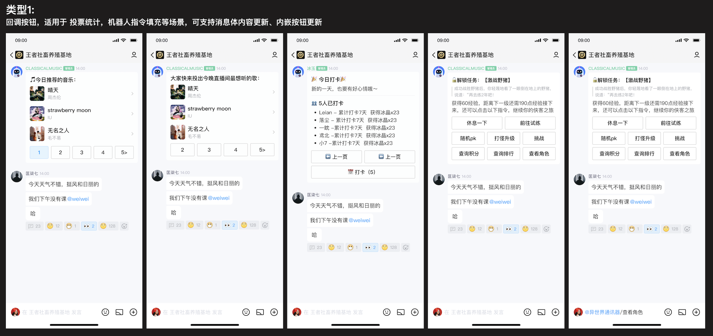

# 无标题

# **QQ机器人消息模板申请配置指引**

本文档介绍在[QQ开放平台](https://q.qq.com/)创建申请QQ频道消息模板的操作流程及注意事项，详细的模板接口请求规则参见[发送Markdown消息接口文档](https://bot.q.qq.com/wiki/develop/api-v2/server-inter/message/type/markdown.html) [发送含有消息按钮组件的消息](https://docs.qq.com/doc/DVE91bG1xbldMV0VR)

申请方式：[https://wj.qq.com/s2/12257706/6310/](https://wj.qq.com/s2/12257706/6310/)

# **一、 Markdown模板申请**

本部分介绍Markdown模板配置页面的使用指引。

## **（一） 必填内容**

● **模板名称：**必填。上限20个字符

● **使用场景：**必填。描述该Markdown模板在实际调用时的下发场景，作为模板审核的重要参考材料。上限300个字符

● **Markdown源码：**必填。带动态参数的Markdown模板源码，不同的动态参数个数不得超过10个。上限1000个字符

● **参数值示例：**模板内容包含动态参数时必填，将用于生成模板消息的预览效果。点击解析后将自动识别所包含的全部动态参数，请模拟实际使用场景逐一填写示例参数值。

## **（二） 操作步骤**

● 在填写完成模板名称、使用场景及模板内容等必填字段后，可点击“解析”按钮自动提取模板内动态参数。

● 开发者须在“配置模板参数”表格中参照真实使用场景，填入参数值示例；完成后即可点击“预览”生成效果图。

● 确认消息预览效果无误后，即可提交保存该模板。

● 保存后可至消息模板列表页提交审核；处于“审核中”及“已通过”的模板仅支持查看，不可二次修改。

## **（三） 参数命名规范**

● 模板参数用双重大括号包裹，前缀为 “.“。

形式如下所示：

{{.content}}       // 参数content

{{.title}}            // title

{{.index_content}} // index_content

---

● 第一个字符必须是字母或下划线

● 后续字符可以是字母、数字或下划线，不得包含@等特殊字符

● 模板参数的有效长度不超过100字符

● 模板参数不能和关键字相同

○ 关键字包括：userid, everyone, all, roleid, emojiid

● 模板参数不区分大小写

● 模板参数命名尽量做到“见名知义”

## **（四） 模板解析及预览**

## **1. 模板解析**

● 请求数据包中对多个同名参数传入不同参数值，以最后传入的参数值为准；

● 请求数据包缺失对某个模板参数传值：

○ 在模板效果预览中将自动填充为 <no value>，以提醒用户二次确认；

○ 实际发送 markdown 消息时，缺失的模板参数将解析成空字符串 “”。

● Markdown不支持换行符

● @及#号跳转在效果预览时不会对具体的用户id或子频道id进行对应转换，以实际在C端的展示内容为准。

● C端消息展示时支持的Markdown语法请参考[机器人Markdown类型消息格式指南](https://docs.qq.com/doc/DS1NyTU5tVlZHeWlD?&u=cc9dc84976144baeb72d7b00ceda4c46)

## **2. 模板预览示例**

示例模板内容1

---

# {{.title}}年度个人报告来啦

- {{.data1}}
- {{.data2}}
- {{.data3}}
- {{.data4}}
- {{.data5}}

---

**请求参数示例1**：

{"key": "title",

"values": [ "2021频道" ]

},

{ "key": "data1",

"values": ["💪2021，我们拾级而上"]

},

{"key": "data2",

"values": [ "✍️时间记录下你的努力" ]

},

{"key": "data3",

"values": [ "❤️也见证你的付出与担当" ]

},

{"key": "data4",

"values": [ "✉️打开这封属于你的专属年度报告" ]

},

{"key": "data5",

"values": [ "✨绽放你的先进时刻" ]

},

{"key": "img_url",

"values": [ "https://resource5-1255303497.cos.ap-guangzhou.myqcloud.com/abcmouse_word_watch/markdown/longpic1.png" ]

}

**Markdown示例结果：**

# 2021频道年度个人报告来啦

- 💪2021，我们拾级而上
- ✍️时间记录下你的努力
- ❤️也见证你的付出与担当
- ✉️打开这封属于你的专属年度报告
- ✨绽放你的先进时刻

示例模板内容2

---

#{{.title}}##<{{.desc}}>{{.index_content}}

---

**请求参数示例1**：

{"key": "title",

"values": [ "标题1" ]

},

{ "key": "desc",

"values": ["标题2"]

},

{"key": "index_content",

"values": [ "标题3" ]

}

**Markdown示例结果1：**"tpl_text": "#标题1##<标题2>标题3"

**请求参数示例2：**

{"key": "title",

"values": [ "标题1" ]

},

{ "key": "desc",

"values": ["标题2"]

},

{ "key": "title",

"values": ["标题0"]

},

{"key": "index_content",

"values": [ "标题3" ]

}

**Markdown示例结果2：**"tpl_text": "#标题0##<标题2>标题3"

- **请求参数重复对同一个模板参数传不同的值，以最后一个传值为准**

**请求参数3：**

{"key": "title",

"values": [ "标题1" ]

},

{ "key": "title",

"values": ["标题2"]

},

{"key": "titlet",

"values": [ "标题3" ]

}

**Markdown示例结果3：** "tpl_text": "#标题3##<<no value>><no value>"

- **请求参数重复对同一个模板参数传不同的值，以最后一个传值为准**
- **模板参数为空时，自动填充为<no value>**

# **二、 消息按钮模板申请**

本部分介绍消息按钮模板配置页面的使用指引。

## **（一） 消息按钮功能介绍**

消息按钮组件是QQ频道支持的消息体下的一种多个button按钮以行列形式排布组合成类似键盘的一种消息按钮组件；支持在mardown消息体下组合使用。

**1、用途**

● 用户点击消息体的button，可以不用给机器人发送消息，通过触发按钮点击，机器人可直接回消息，比如投票统计、放机器人的指令等；

● 可以在当前消息体上看到更多更新内容，比如翻页，刷新；

● 可以跳转到链接，比如分享到其他频道列表，跳转外部链接；

● 可以实现 呼起当前频道的指令半屏面板或者 内容内联的半屏面板，让用户发现更多机器人指令、机器人内容；

**2、基础按钮种类**

● 回调button

适用于投票统计、机器人指令填充等场景，能支持消息体内容的更新、消息按钮组件的整体更新；

● 网址button

适用于跳转外链或者小程序链接；

● 切换到当前频道的指令半屏botton

适用于让用户发现 该机器人的更多指令功能；

● 当前频道的内联内容半屏button

适用于接入内联能力的机器人，支持用户搜索出更多喜欢和想要分享的内容；

**3、消息按钮样式**

只支持2种样式可选，建议多用灰色线框，蓝色线框可用于突出显示效果。

## **（二） 配置必填内容**

● **模板名称：**必填。上限20个字符

● **使用场景：**必填。描述该Markdown模板在实际调用时的下发场景，作为模板审核的重要参考材料。上限300个字符

● **JSON源码：**必填。按照API文档规范设计的消息按钮模板JSON源码，消息按钮模板仅支持固定使用，不支持动态传参。

## **（三） 操作步骤**

● 在填写完成模板名称、使用场景及JSON源码等必填字段后，系统自动预览消息按钮模板样式。

● 确认预览效果无误后，即可提交保存该模板。

● 保存后可至消息模板列表页提交审核；处于“审核中”及“已通过”的模板仅支持查看，不可二次修改。

**备注：**

● 每个机器人最多可以申请使用4个消息模板，暂时不支持提升上限数。

● 私域机器人开通消息模板功能后转为公域机器人将回收该功能，开发者可按照公域机器人标准重新申请开通。

